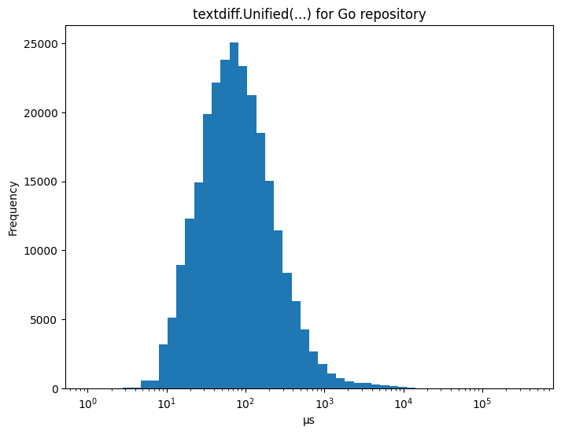

# znkr.io/diff

A difference algorithm module for Go.

Difference algorithms compare two inputs and find the edits that transform one to the other. This is
very useful to understand changes, for example when comparing a test result with the expected result
or to understand which changes have been made to a file.

This module provides diffing for arbitrary Go slices and text.

Documentation at http://pkg.go.dev/znkr.io/diff.

## Stability: Beta

This project is in beta, pending API reviews and general feedback, both are very welcome.

As a general rule, the exact diff output will never be guaranteed to be stable: I expect that
performance and quality improvements will always be possible and they will likely change the output
of a diff. Therefore, committing to a stable diff result would be too limiting.

## Example - Comparing Slices

Diffing two slices produces either the full list of edits

```go
x := strings.Fields("calm seas reflect the sky")
y := strings.Fields("restless seas reflect the sky defiantly")
edits := diff.Edits(x, y)
for i, edit := range edits {
    if i > 0 {
        fmt.Print(" ")
    }
    switch edit.Op {
    case diff.Match:
        fmt.Printf("%s", edit.X)
    case diff.Delete:
        fmt.Printf("[-%s-]", edit.X)
    case diff.Insert:
        fmt.Printf("{+%s+}", edit.Y)
    default:
        panic("never reached")
    }
}
// Output:
// [-calm-] {+restless+} seas reflect the sky {+defiantly+}
```

or a list of hunks representing consecutive edits

```go
x := strings.Fields("calm seas reflect the sky")
y := strings.Fields("restless seas reflect the sky defiantly")
hunks := diff.Hunks(x, y, diff.Context(1))
for i, h := range hunks {
    if i > 0 {
        fmt.Print(" … ")
    }
    for i, edit := range h.Edits {
        if i > 0 {
            fmt.Print(" ")
        }
        switch edit.Op {
        case diff.Match:
            fmt.Printf("%s", edit.X)
        case diff.Delete:
            fmt.Printf("[-%s-]", edit.X)
        case diff.Insert:
            fmt.Printf("{+%s+}", edit.Y)
        default:
            panic("never reached")
        }
    }
}
// Output:
// [-calm-] {+restless+} seas … sky {+defiantly+}
```

For both functions, a `...Func` variant exists that works with arbitrary slices by taking an
equality function.

## Example - Comparing Text

Because of its importance, comparing text line by line has special support and produces output
in the unified diff format:

```go
x := `this paragraph
is not
changed and
barely long
enough to
create a
new hunk

this paragraph
is going to be
removed
`

y := `this is a new paragraph
that is inserted at the top

this paragraph
is not
changed and
barely long
enough to
create a
new hunk
`
fmt.Print(textdiff.Unified(x, y))
// Output:
// @@ -1,3 +1,6 @@
// +this is a new paragraph
// +that is inserted at the top
// +
//  this paragraph
//  is not
//  changed and
// @@ -5,7 +8,3 @@
//  enough to
//  create a
//  new hunk
// -
// -this paragraph
// -is going to be
// -removed
```

## Diff Readability

Diffs produced by this module are intended to be readable by humans.

Readable diffs have been the subject of a lot of discussions and have even resulted in some new
diffing algorithms like the patience or histogram algorithms in git. However, the best work about
diff readability by far is [diff-slider-tools](https://github.com/mhagger/diff-slider-tools) by
[Michael Haggerty](https://github.com/mhagger). He implemented a heuristic that's applied in a
post-processing step to improve the readability. This module implements this heuristic in the
[textdiff](https://pkg.go.dev/znkr.io/diff/textdiff) package.

For example:

```go
x := `// ...
["foo", "bar", "baz"].map do |i|
  i.upcase
end
`

y := `// ...
["foo", "bar", "baz"].map do |i|
  i
end

["foo", "bar", "baz"].map do |i|
  i.upcase
end
`

fmt.Println("With textdiff.IndentHeuristic:")
fmt.Print(textdiff.Unified(x, y, textdiff.IndentHeuristic()))
fmt.Println()
fmt.Println("Without textdiff.IndentHeuristic:")
fmt.Print(textdiff.Unified(x, y))
// Output:
// With textdiff.IndentHeuristic:
// @@ -1,4 +1,8 @@
//  // ...
// +["foo", "bar", "baz"].map do |i|
// +  i
// +end
// +
//  ["foo", "bar", "baz"].map do |i|
//    i.upcase
//  end
//
// Without textdiff.IndentHeuristic:
// @@ -1,4 +1,8 @@
//  // ...
//  ["foo", "bar", "baz"].map do |i|
// +  i
// +end
// +
// +["foo", "bar", "baz"].map do |i|
//    i.upcase
//  end
```

## Performance

The underlying diff algorithm used is Myers' algorithm augmented by a number of standard heuristics
to speed up the algorithm in exchange for non-minimal diffs. The `diff.Optimal` option is provided
to skip these heuristics to get a minimal diff independent of the costs.

On an M1 Mac, the default settings almost always result in runtimes &lt; 1 ms, but truly large diffs
(e.g. caused by changing generators for generated files) can result in runtimes around 100 ms and
more. Below is the distribution of runtimes applying `textdiff.Unified` to every commit in the [Go
repository](http://go.googlesource.com/go):



## Correctness

I tested this diff implementation against every commit in the [Go
repository](http://go.googlesource.com/go) using the standard unix `patch` tool to ensure that all
diff results are correct.

This test is part of the test suite for this module and can be run with

```
go run ./internal/cmd/eval -repo <repo>
```

## License

This module is distributed under the [Apache License, Version
2.0](https://www.apache.org/licenses/LICENSE-2.0), see [LICENSE](LICENSE) for more information.
