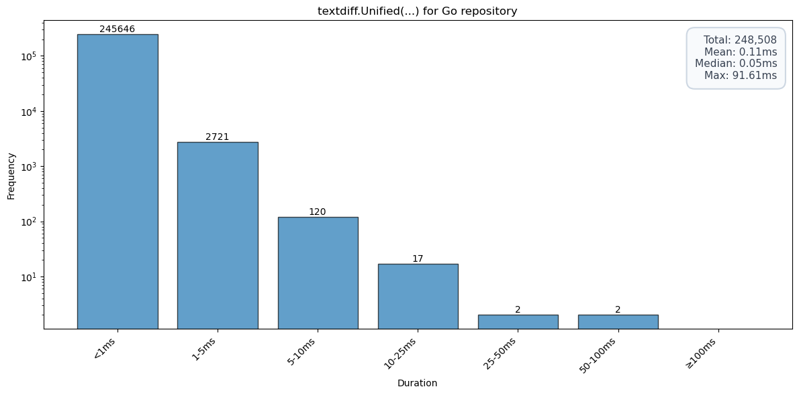

# znkr.io/diff

[](https://pkg.go.dev/znkr.io/diff)
[](https://goreportcard.com/report/znkr.io/diff)

A high-performance difference algorithm module for Go.

Difference algorithms compare two inputs and find the edits that transform one to the other. This is
very useful to understand changes, for example when comparing a test result with the expected result
or to understand which changes have been made to a file.

This module provides diffing for arbitrary Go slices and text.

## Installation

To use this module in your Go project, run:

```bash
go get znkr.io/diff
```

## API Documentation

Full documentation available at [pkg.go.dev/znkr.io/diff](https://pkg.go.dev/znkr.io/diff).

## Examples

### Comparing Slices

Diffing two slices produces either the full list of edits

```go
x := strings.Fields("calm seas reflect the sky")
y := strings.Fields("restless seas reflect the sky defiantly")
edits := diff.Edits(x, y)
for i, edit := range edits {
    if i > 0 {
        fmt.Print(" ")
    }
    switch edit.Op {
    case diff.Match:
        fmt.Printf("%s", edit.X)
    case diff.Delete:
        fmt.Printf("[-%s-]", edit.X)
    case diff.Insert:
        fmt.Printf("{+%s+}", edit.Y)
    default:
        panic("never reached")
    }
}
// Output:
// [-calm-] {+restless+} seas reflect the sky {+defiantly+}
```

or a list of hunks representing consecutive edits

```go
x := strings.Fields("calm seas reflect the sky")
y := strings.Fields("restless seas reflect the sky defiantly")
hunks := diff.Hunks(x, y, diff.Context(1))
for i, h := range hunks {
    if i > 0 {
        fmt.Print(" … ")
    }
    for i, edit := range h.Edits {
        if i > 0 {
            fmt.Print(" ")
        }
        switch edit.Op {
        case diff.Match:
            fmt.Printf("%s", edit.X)
        case diff.Delete:
            fmt.Printf("[-%s-]", edit.X)
        case diff.Insert:
            fmt.Printf("{+%s+}", edit.Y)
        default:
            panic("never reached")
        }
    }
}
// Output:
// [-calm-] {+restless+} seas … sky {+defiantly+}
```

For both functions, a `...Func` variant exists that works with arbitrary slices by taking an
equality function.

### Comparing Text

Because of its importance, comparing text line by line has special support and produces output
in the unified diff format:

```go
x := `this paragraph
is not
changed and
barely long
enough to
create a
new hunk

this paragraph
is going to be
removed
`

y := `this is a new paragraph
that is inserted at the top

this paragraph
is not
changed and
barely long
enough to
create a
new hunk
`
fmt.Print(textdiff.Unified(x, y))
// Output:
// @@ -1,3 +1,6 @@
// +this is a new paragraph
// +that is inserted at the top
// +
//  this paragraph
//  is not
//  changed and
// @@ -5,7 +8,3 @@
//  enough to
//  create a
//  new hunk
// -
// -this paragraph
// -is going to be
// -removed
```

## Stability

**Status: Beta** - This project is in beta, pending API reviews and general feedback, both are very
welcome.

As a general rule, the exact diff output will never be guaranteed to be stable: I expect that
performance and quality improvements will always be possible and they will likely change the output
of a diff. Therefore, committing to a stable diff result would be too limiting.


## Diff Readability

Diffs produced by this module are intended to be readable by humans.

Readable diffs have been the subject of a lot of discussions and have even resulted in some new
diffing algorithms like the patience or histogram algorithms in git. However, the best work about
diff readability by far is [diff-slider-tools](https://github.com/mhagger/diff-slider-tools) by
[Michael Haggerty](https://github.com/mhagger). He implemented a heuristic that's applied in a
post-processing step to improve the readability. This module implements this heuristic in the
[textdiff](https://pkg.go.dev/znkr.io/diff/textdiff) package.

For example:

```go
x := `// ...
["foo", "bar", "baz"].map do |i|
  i.upcase
end
`

y := `// ...
["foo", "bar", "baz"].map do |i|
  i
end

["foo", "bar", "baz"].map do |i|
  i.upcase
end
`

fmt.Println("With textdiff.IndentHeuristic:")
fmt.Print(textdiff.Unified(x, y, textdiff.IndentHeuristic()))
fmt.Println()
fmt.Println("Without textdiff.IndentHeuristic:")
fmt.Print(textdiff.Unified(x, y))
// Output:
// With textdiff.IndentHeuristic:
// @@ -1,4 +1,8 @@
//  // ...
// +["foo", "bar", "baz"].map do |i|
// +  i
// +end
// +
//  ["foo", "bar", "baz"].map do |i|
//    i.upcase
//  end
//
// Without textdiff.IndentHeuristic:
// @@ -1,4 +1,8 @@
//  // ...
//  ["foo", "bar", "baz"].map do |i|
// +  i
// +end
// +
// +["foo", "bar", "baz"].map do |i|
//    i.upcase
//  end
```

## Performance

By default, the underlying diff algorithm used is Myers' algorithm augmented by a number of
heuristics to speed up the algorithm in exchange for non-minimal diffs. The `diff.Optimal` option is
provided to skip these heuristics to get a minimal diff independent of the costs and `diff.Fast` to
use a fast heuristic to get a non-minimal diff as fast as possible.

On an M1 Mac, the default settings almost always result in runtimes &lt; 1 ms, but truly large diffs
(e.g. caused by changing generators for generated files) can result in runtimes of almost 100 ms.
Below is the distribution of runtimes applying `textdiff.Unified` to every commit in the [Go
repository](http://go.googlesource.com/go)  (y-axis is in log scale):



### Comparison with other Implementations

Comparing the performance with other Go modules that implement the same features is always
interesting, because it can surface missed optimization opportunities. This is especially
interesting for larger inputs where superlinear growth can become a problem. Below are benchmarks of
`znkr.io/diff` against other popular Go diff modules:

- **znkr**: Default configuration with performance optimizations enabled
- **znkr-optimal**: With `diff.Optimal()` option for minimal diffs
- **znkr-fast**: With `diff.Fast()` option for fastest possible diffing
- **go-internal**: Patience diff algorithm from [`github.com/rogpeppe/go-internal`](https://github.com/rogpeppe/go-internal)
- **diffmatchpatch**: Implementation from [`github.com/sergi/go-diff`](https://github.com/sergi/go-diff)

**Note:** It's possible that the benchmark is using `diffmatchpatch` incorrectly, the benchmark
numbers certainly look suspiciously high. However, the way it's used in the benchmark is used in
at least one large open source project.

#### Runtime Performance (seconds per operation)

On the benchmarks used for this comparison znkr.io/diff almost always outperforms the other
implementations. However, there's one case where go-internal is significantly faster, but the
resulting diff is 10% larger (see numbers below).

| Test Case | znkr (baseline) | znkr-optimal | znkr-fast | go-internal | diffmatchpatch |
|-----------|-----------------|--------------|-----------|-------------|----------------|
| **large_01** | 2.605ms | 10.813ms<br>(+315.06%) | 2.606ms<br>(±0%) | 4.888ms<br>(+87.60%) | 42.546ms<br>(+1533.09%) |
| **large_02** | 20.611ms | 49.379ms<br>(+139.58%) | 1.805ms<br>(-91.24%) | 4.190ms<br>(-79.67%) | 628.690ms<br>(+2950.32%) |
| **large_03** | 3.054ms | 14.910ms<br>(+388.18%) | 3.129ms<br>(±0%) | 4.789ms<br>(+56.80%) | 30.803ms<br>(+908.56%) |
| **large_04** | 6.707ms | 251.801ms<br>(+3654.45%) | 5.749ms<br>(-14.28%) | 8.735ms<br>(+30.24%) | 1011.684ms<br>(+14984.61%) |
| **medium** | 25.00µs | 24.72µs<br>(±0%) | 27.46µs<br>(+9.86%) | 67.55µs<br>(+170.24%) | 247.63µs<br>(+890.72%) |
| **small** | 17.15µs | 16.99µs<br>(±0%) | 16.71µs<br>(-2.56%) | 39.48µs<br>(+130.15%) | 72.75µs<br>(+324.13%) |

#### Diff Minimality (number of edits produced)

| Test Case | znkr (baseline) | znkr-optimal | znkr-fast | go-internal | diffmatchpatch |
|-----------|----------------|--------------|-----------|-------------|----------------|
| **large_01** | 5.615k edits | 5.615k edits<br>(±0%) | 5.615k edits<br>(±0%) | 5.617k edits<br>(+0.04%) | 5.616k edits<br>(+0.02%) |
| **large_02** | 28.87k edits | 28.83k edits<br>(-0.15%) | 31.80k edits<br>(+10.15%) | 31.81k edits<br>(+10.17%) | 28.83k edits<br>(-0.14%) |
| **large_03** | 5.504k edits | 5.504k edits<br>(±0%) | 5.504k edits<br>(±0%) | 5.506k edits<br>(+0.04%) | 5.505k edits<br>(+0.02%) |
| **large_04** | 26.99k edits | 26.99k edits<br>(-0.01%) | 27.80k edits<br>(+2.99%) | 27.80k edits<br>(+2.99%) | 60.36k edits<br>(+123.65%) |
| **medium** | 277 edits | 277 edits<br>(±0%) | 277 edits<br>(±0%) | 283 edits<br>(+2.17%) | 278 edits<br>(+0.36%) |
| **small** | 108 edits | 108 edits<br>(±0%) | 114 edits<br>(+5.56%) | 120 edits<br>(+11.11%) | 109 edits<br>(+0.93%) |

## Correctness

I tested this diff implementation against every commit in the [Go
repository](http://go.googlesource.com/go) using the standard unix `patch` tool to ensure that all
diff results are correct.

This test is part of the test suite for this module and can be run with

```
go run ./internal/cmd/eval -repo <repo>
```

## License

This module is distributed under the [Apache License, Version
2.0](https://www.apache.org/licenses/LICENSE-2.0), see [LICENSE](LICENSE) for more information.
